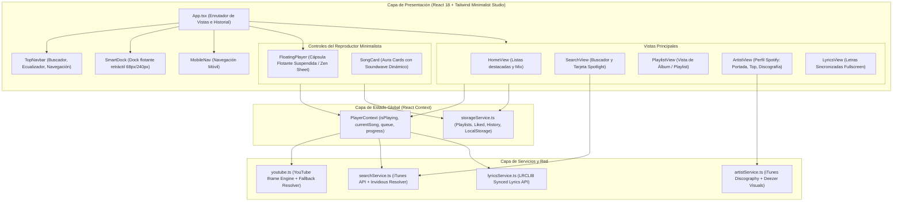

# 🏗️ Arquitectura de Free-Spoty

Este documento describe la arquitectura general de **Free-Spoty**, la jerarquía de componentes, la gestión de estados y el flujo de datos que permite ofrecer una experiencia similar a una aplicación nativa.

---

## 🧩 Diagrama de Componentes y Flujo de Datos



---

## 📁 Estructura del Código Fuente (`src/`)

```text
src/
├── App.tsx                      # Orquestador raíz: layout libre, dock y cápsula flotante con enrutamiento de vistas
├── main.tsx                     # Punto de entrada de React 18 en Vite
├── index.css                    # Estilos globales y personalización Tailwind
├── types/
│   └── music.ts                 # Interfaces TypeScript: Song, Album, ArtistProfile, Playlist, etc.
├── context/
│   └── PlayerContext.tsx        # Estado central del reproductor, cola inteligente, volumen y MediaSession
├── components/
│   ├── Navigation/
│   │   ├── SmartDock.tsx        # Dock flotante retráctil 3D (68px contraído, 240px al interactuar)
│   │   └── MobileNav.tsx        # Barra de navegación inferior fija para móviles
│   ├── Player/
│   │   ├── FloatingPlayer.tsx   # Cápsula de sonido flotante suspendida con scrubber perimétrico y Zen Sheet
│   │   ├── LyricsView.tsx       # Pantalla completa de letras sincronizadas con scroll automático
│   │   ├── QueueDrawer.tsx      # Cajón lateral de cola interactiva con reordenación
│   │   └── EqualizerModal.tsx   # Ecualizador de 5 bandas con presets de audio pro
│   ├── UI/
│   │   ├── SongCard.tsx         # Aura Minimalist Card con soundwave dinámico y rim glow
│   │   ├── AmbientBackground.tsx# Fondo ambiental reactivo (Obsidian Midnight sin tonos verdes)
│   │   └── Modal.tsx            # Modales genéricos de la aplicación
│   ├── Views/
│   │   ├── HomeView.tsx         # Pantalla de inicio con playlists destacadas y accesos rápidos
│   │   ├── SearchView.tsx       # Buscador instantáneo con tarjeta "Resultado principal"
│   │   ├── PlaylistView.tsx     # Vista detallada de listas de reproducción con cabecera dinámica
│   │   └── ArtistView.tsx       # Perfil oficial de artista con discografía y oyentes
│   └── TopNavbar.tsx            # Barra superior con buscador integrado y ecualizador
└── services/
    ├── youtube.ts               # Motor de reproducción de YouTube Iframe API y gestor de watchdog
    ├── searchService.ts         # Consultas de metadatos (iTunes) y resolución dinámica de audio (Invidious)
    ├── artistService.ts         # Obtención de discografía, portadas en 1000x1000 y conteo de oyentes
    ├── lyricsService.ts         # Proveedor de letras sincronizadas (LRCLIB)
    ├── storageService.ts        # Persistencia en localStorage (favoritos, playlists, historial)
    └── exploreData.ts           # Listas destacadas precargadas con metadatos verificados
```

---

## 🔄 Gestión de Rutas y Navegación Interna

Para garantizar máxima compatibilidad con **GitHub Pages** sin problemas de enrutamiento del lado del servidor (404 en refresco), la aplicación utiliza un **sistema de enrutamiento basado en estado e historial**:

1. **Vistas Soportadas (`ViewType`):**
   - `'home'`: Pantalla principal con accesos rápidos y secciones.
   - `'search'`: Explorador y resultados de búsqueda.
   - `'playlist'`: Contenido de una lista o álbum.
   - `'artist'`: Perfil completo del artista seleccionado (`selectedArtistName`).
2. **Pila de Historial (`historyStack`):**
   - Cada cambio de vista añade la vista anterior a una pila (`historyStack: ViewState[]`).
   - El botón atrás (`←`) desapila y restaura la vista previa exactamente en su estado, permitiendo navegar entre canciones, artistas y listas con total naturalidad tanto en escritorio como en móvil.
3. **Navegación al Artista (`onNavigateArtist`):**
   - Una función centralizada inyectada en todos los componentes (`SongCard`, `SearchView`, `PlaylistView`, `BottomPlayer`, `LyricsView`).
   - Al pulsar sobre el nombre del artista en cualquier parte de la aplicación, el usuario es redirigido inmediatamente a la vista `'artist'`.

---

## 🎛️ Contextos Principales

### 1. `PlayerContext` (`src/context/PlayerContext.tsx`)
- **Responsabilidades:**
  - Control de reproducción: `playSong(song, contextQueue)`, `togglePlay()`, `seek(seconds)`, `nextTrack()`, `prevTrack()`.
  - Estados reactivos: `isPlaying`, `isLoadingSong`, `currentTime`, `duration`, `volume`, `isMuted`, `isShuffle`, `repeatMode` (`'off' | 'all' | 'one'`).
  - **Sincronización con YouTube Engine:** Escucha cambios de estado (`onStateChange`) y códigos de error (`onError`).
  - **MediaSession API:** Actualiza los controles de la pantalla de bloqueo de iOS/Android con el título, artista y carátulas en 512x512.
  - **Letras Sincronizadas:** Dispara automáticamente la descarga de letras a través de `fetchLyrics` al cambiar de tema.

### 2. `MusicContext` (`src/context/MusicContext.tsx`)
- **Responsabilidades:**
  - Persistencia en `localStorage` de las canciones favoritas (`likedSongs`).
  - Creación, edición y borrado de playlists del usuario.
  - Historial reciente de reproducción (`playHistory`).
