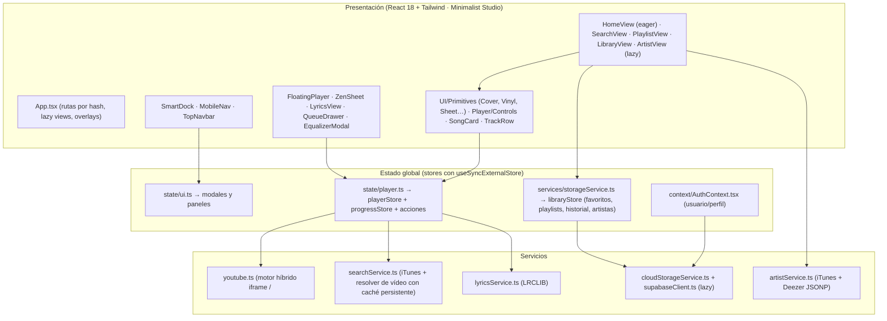

# 🏗️ Arquitectura de Free-Spoty

Este documento describe la arquitectura de **Free-Spoty** tras el overhaul de rendimiento (v2): capas, gestión de estado con stores de suscripción selectiva, enrutado por hash y flujo de datos.

---

## 🧩 Diagrama de capas



---

## 📁 Estructura de `src/`

```text
src/
├── App.tsx                     # Shell: rutas, vistas lazy, overlays montados solo al abrirse
├── main.tsx
├── index.css                   # Estilos base + utilidades (vinyl-spin, cv-auto, scrollbar-none)
├── vite-env.d.ts               # Tipos de import.meta.env y __APP_VERSION__
├── types/music.ts              # Song, Playlist, Album, ArtistProfile, LyricsResult…
├── lib/
│   ├── store.ts                # createStore + useStore(selector)  ← núcleo del rendimiento
│   ├── net.ts                  # fetchJson (timeout), fetchJsonp, raceFirst, TtlCache, dedupe, safeStorage
│   ├── images.ts               # artwork(url, size), FALLBACK_COVER, onImageError
│   └── format.ts               # formatTime, getGreeting, songKey, cleanTitle
├── state/
│   ├── player.ts               # Reproductor: estado, acciones, MediaSession, sleep timer, sesión
│   └── ui.ts                   # Modales/paneles (letras, cola, EQ, import, auth, añadir a playlist)
├── context/AuthContext.tsx     # Sesión Supabase (SDK cargado bajo demanda)
├── hooks/
│   ├── useNavigation.ts        # Router por hash integrado con history (atrás de Android/iOS)
│   ├── useKeyboardShortcuts.ts # Atajos globales (registro único)
│   ├── useVersionCheck.ts      # Detección de despliegues sin cortar la música
│   └── useDominantColor.ts     # Color de carátula para el fondo ambiental
├── services/
│   ├── youtube.ts              # Motor de audio (ver audio-engine.md)
│   ├── searchService.ts        # Búsqueda iTunes + resolución Canción → vídeo
│   ├── artistService.ts        # Perfil de artista y discografía
│   ├── lyricsService.ts        # Letras LRC + búsqueda binaria de línea activa
│   ├── storageService.ts       # libraryStore + persistencia local + ajustes + backups
│   ├── cloudStorageService.ts  # Escrituras Supabase serializadas + migración de invitado
│   ├── supabaseClient.ts       # getSupabase() con import dinámico
│   ├── config.ts               # URL de servidor propio, API Key, presets de EQ
│   ├── itunes.ts               # Mapeo de resultados iTunes → Song
│   └── exploreData.ts          # Playlists destacadas con IDs verificados
└── components/
    ├── Navigation/  SmartDock.tsx · MobileNav.tsx
    ├── Player/      FloatingPlayer.tsx · ZenSheet.tsx · Controls.tsx · LyricsView.tsx · QueueDrawer.tsx · EqualizerModal.tsx
    ├── UI/          Primitives.tsx · SongCard.tsx · TrackRow.tsx · AmbientBackground.tsx · AuthModal.tsx · AddToPlaylistModal.tsx · CreatePlaylistSheet.tsx
    ├── Views/       HomeView · SearchView · PlaylistView · LibraryView · ArtistView · ImportExportModal
    └── TopNavbar.tsx
```

---

## ⚡ Gestión de estado: stores con suscripción selectiva

**Problema original:** `PlayerContext` exponía `currentTime`, actualizado 4 veces por segundo. Cualquier componente que usara `usePlayer()` (cada `SongCard`, las vistas, la barra superior, el fondo) se re-renderizaba 4 veces por segundo mientras sonaba música. Además, cada tarjeta ejecutaba `JSON.parse(localStorage)` en cada render (`isSongLiked`, `getCustomPlaylists`).

**Solución (`lib/store.ts`):** stores mínimos sobre `useSyncExternalStore`. Cada componente declara un selector y solo se re-renderiza si **ese valor** cambia:

```tsx
const isPlaying = useIsSongPlaying(song.id);           // boolean: solo cambia para 1-2 tarjetas
const liked = useIsLiked(song.id);                     // Set en memoria, O(1)
const currentTime = useCurrentTime();                  // solo Scrubber, ProgressLine y letras
```

| Store | Contenido | Frecuencia de cambio |
| :--- | :--- | :--- |
| `playerStore` | canción, cola, play/pausa, volumen, letras, temporizador, error | Pocas veces por minuto |
| `progressStore` | `currentTime` | 4/s (solo mientras suena) |
| `uiStore` | modales y paneles abiertos | Por interacción |
| `libraryStore` | favoritos (+ `Set` de IDs), playlists, historial, artistas seguidos | Por interacción |

**Reglas:**
1. Los selectores devuelven primitivos o referencias existentes; nunca objetos nuevos (bucle infinito).
2. Las acciones (`playerActions.*`, `ui.*`, `toggleLikeSong`…) son funciones de módulo estables que leen el estado actual con `store.get()`: no hay closures obsoletos en MediaSession ni en los atajos de teclado.
3. `SongCard`, `TrackRow` y los controles están memoizados; el menú contextual solo lee las playlists cuando se abre.

---

## 🔄 Rutas (`hooks/useNavigation.ts`)

Enrutado por hash, compatible con GitHub Pages (sin 404 al refrescar) y enlazable:

| Ruta | Vista |
| :--- | :--- |
| `#/` | Inicio |
| `#/search/<consulta>` | Búsqueda (la consulta vive en la URL; teclear usa `replaceState`) |
| `#/library`, `#/liked`, `#/history` | Biblioteca, Me Gusta, Historial |
| `#/playlist/<id>` | Playlist destacada o propia |
| `#/artist/<nombre>` | Perfil de artista |

- Cada entrada del historial guarda `{ idx }`: los botones ←/→ de la barra superior y el botón **atrás del sistema** (Android/iOS) navegan dentro de la app.
- Hashes editados a mano o enlaces `<a href="#/…">` también se sincronizan (`hashchange`).
- Al cambiar de vista, el contenedor de scroll vuelve arriba.

---

## 📦 Carga y rendimiento

- **Code splitting:** Inicio va en el bundle principal; Búsqueda, Playlist, Biblioteca, Artista y todos los modales/paneles son chunks `lazy` que se montan solo al abrirse.
- **Supabase bajo demanda:** `getSupabase()` importa el SDK (~59 KB gzip) en paralelo, sin bloquear el primer render.
- **Chunks estables:** `react` e `icons` separados (`vite.config.ts → manualChunks`) para mejor caché entre despliegues.
- **Imágenes a su tamaño:** `artwork(url, size)` pide a mzstatic/Unsplash la resolución que se pinta (120 px en miniaturas en lugar de 600 px).
- **`content-visibility: auto`** en las secciones de Inicio fuera de pantalla.

| Métrica (build de producción) | Antes | Después |
| :--- | :--- | :--- |
| JS inicial | 580 KB (153 KB gzip), 1 chunk | 267 KB (≈84 KB gzip) + chunks lazy |
| Re-renders por tick del reproductor | Toda la app | Solo Scrubber / letras |
| Lectura de favoritos por tarjeta | `JSON.parse(localStorage)` por render | `Set.has()` en memoria |
| Reproducir una canción ya escuchada tras recargar | Re-búsqueda en red | Caché persistente (0 peticiones) |
