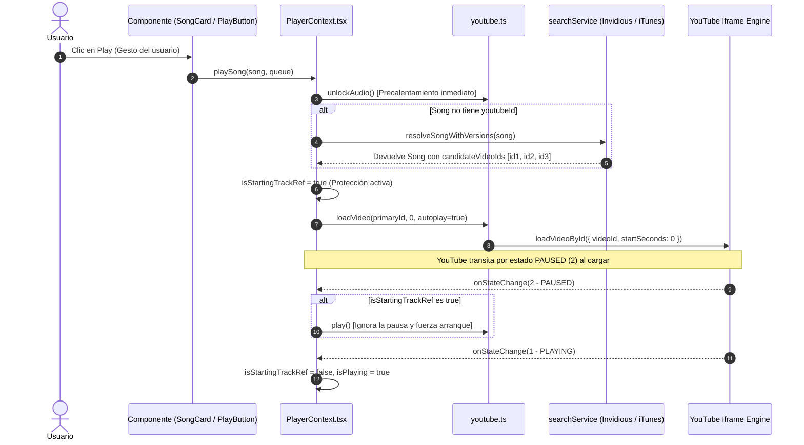

# 🔊 El Motor de Audio: Reproducción Continua y Confiable

El motor de audio de **Free-Spoty** está diseñado para resolver uno de los mayores desafíos en reproductores web basados en YouTube: **reproducir cualquier pista en milisegundos con un solo toque, sin interrupciones, sin anuncios y sorteando las restricciones de los navegadores móviles y las discográficas.**

Este documento desglosa cada componente técnico del motor ubicado en `src/services/youtube.ts`, `src/services/searchService.ts` y `src/context/PlayerContext.tsx`.

---

## ⚡ El Ciclo de Reproducción (1-Tap Playback)



---

## 🛡️ Componentes Clave del Motor

### 1. Protección contra Pausas Espurias (`isStartingTrackRef`)
- **Problema Detectado:** Al invocar `player.loadVideoById()`, la API interna de YouTube pasa brevemente por el estado `2` (`PAUSED`) o `-1` (`UNSTARTED`) mientras inicializa el búfer. Si el oyente de eventos actualiza `isPlaying = false`, el botón de la interfaz cambia a pausa antes de empezar a sonar y la canción se cancela.
- **Solución:** 
  - Al iniciar una pista en `executePlaySong`, se activa `isStartingTrackRef.current = true` con un temporizador de seguridad de 5 segundos.
  - En `onStateChange`: si el estado recibido es `2` (`PAUSED`) mientras `isStartingTrackRef` está activo, se ignora el apagado de la reproducción y se invoca `youtubeService.play()`.
  - Cuando el reproductor emite `1` (`PLAYING`), la protección se desactiva y la interfaz confirma el estado de reproducción.

### 2. Visibilidad e Integración DOM (`opacity: 1`, `z-index: -9999`)
- **Problema de Políticas de Navegador:** Navegadores móviles (iOS Safari, Android Chrome) y scripts anti-bot de YouTube auditan la visibilidad del contenedor (`IntersectionObserver`). Un iframe con `opacity: 0.001`, `display: none` o `visibility: hidden` es catalogado como elemento invisible de fondo, bloqueando el autoplay o pausando el flujo.
- **Implementación:**
  ```typescript
  container.style.position = 'fixed';
  container.style.bottom = '0px';
  container.style.right = '0px';
  container.style.width = '200px';
  container.style.height = '120px';
  container.style.opacity = '1';          // Cumple con la política de visibilidad
  container.style.pointerEvents = 'none';  // No bloquea clics del usuario
  container.style.zIndex = '-9999';        // Físicamente oculto tras la app (#09090b)
  ```

### 3. Resolución Dinámica de Multi-Candidatos (`candidateVideoIds`)
Para evitar depender de un único video que pudiera tener restricciones geográficas o bloqueos de inserción (Error 150/101), `searchService.ts` obtiene una lista jerarquizada de identificadores de video:
1. **Consulta Primaria Directa:** `${artista} ${título}` (devuelve el video oficial y versiones con letra en los primeros 3 resultados).
2. **Consulta de Respaldo 1:** `${artista} ${título} audio` (versión pista de estudio).
3. **Consulta de Respaldo 2:** `${artista} ${título} Topic` (lanzamiento oficial de YouTube Music).

Los identificadores válidos se almacenan en `candidateVideoIds`.

### 4. Recuperación Automática ante Errores (`unbindError`)
Si YouTube devuelve un código de error (150, 101, 100):
```typescript
const unbindError = youtubeService.onError((code) => {
  const song = stateRef.current.currentSong;
  if (song) {
    // 1. Probar siguiente candidato de la lista
    const currentId = song.youtubeId;
    const candidates = song.candidateVideoIds || [];
    const currentIndex = candidates.indexOf(currentId);
    if (currentIndex >= 0 && currentIndex < candidates.length - 1) {
      const nextId = candidates[currentIndex + 1];
      song.youtubeId = nextId;
      isStartingTrackRef.current = true;
      youtubeService.loadVideo(nextId, 0, true);
      return;
    }
    // 2. Probar versión alternativa (lyrics/original)
    // 3. Re-resolución dinámica en vivo con Invidious
  }
});
```

### 5. Watchdog de Reproducción Stalled
En `loadVideo()`, se inicia un temporizador de vigilancia a los 3 segundos:
- Si el reproductor permanece en estado `3` (buffering), `-1` (unstarted) o `2` (paused), el watchdog ejecuta un re-kick (`player.playVideo()`) para forzar el flujo de audio.

---

## 🌐 Instancias Invidious y CORS

Para buscar videos de YouTube desde el navegador del cliente sin necesidad de una clave de API de pago de Google, la aplicación consulta instancias públicas de Invidious que admiten CORS (`Access-Control-Allow-Origin: *`):
- Instancia primaria activa y verificada: `https://invidious.f5.si/api/v1/search` (tiempo de respuesta habitual < 900ms).
- En caso de lentitud, el timeout por instancia está fijado en 2000ms para saltar de inmediato al siguiente nodo sin congelar la interfaz.
