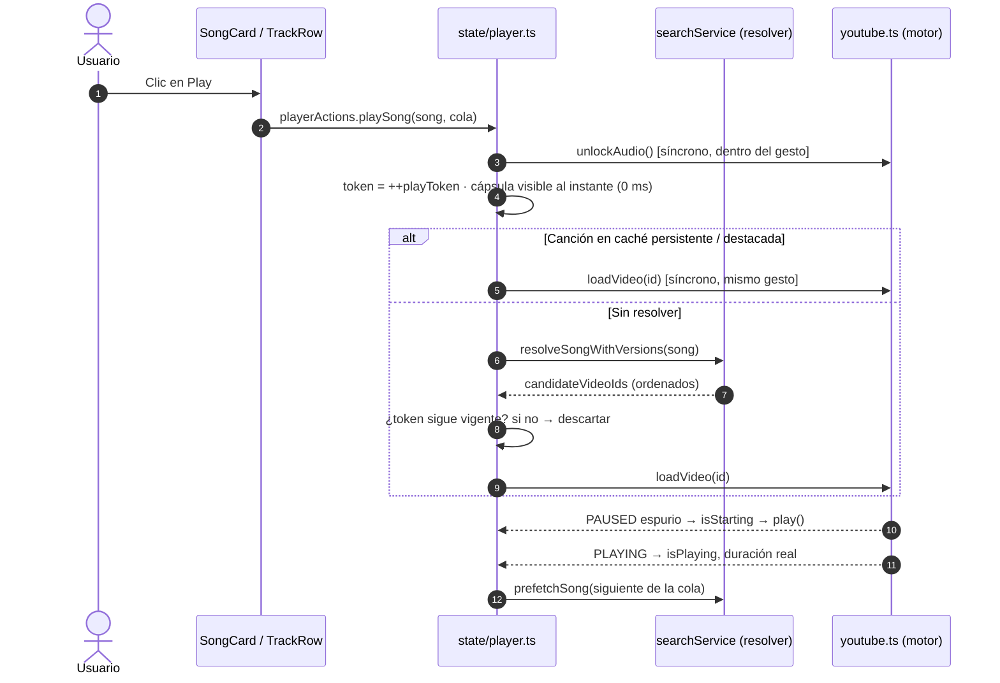

# 🔊 El Motor de Audio: Reproducción Continua y Confiable

Objetivo: **reproducir cualquier pista con un solo toque, sin cortes, sin anuncios y sorteando las restricciones de navegadores móviles y discográficas.**

Piezas: `src/services/youtube.ts` (motor), `src/services/searchService.ts` (resolver) y `src/state/player.ts` (orquestación).

---

## ⚡ Ciclo de reproducción (1-Tap Playback)



---

## 🛡️ Componentes clave

### 1. Token de reproducción (anti-carreras)
Cada `startTrack()` incrementa `playToken`. Si el usuario pulsa otra canción mientras la primera se resolvía, la resolución lenta se descarta al volver (`if (token !== playToken) return`). Antes podía sonar la canción anterior al terminar su búsqueda.

### 2. Protección contra pausas espurias (`isStarting`)
Al llamar a `loadVideoById()`, YouTube emite `PAUSED (2)` mientras inicializa el búfer. Durante 5 s tras cargar (4 s tras un `play()`), un `PAUSED` se ignora y se re-lanza `play()`. `PLAYING (1)` desactiva la protección. *(Lección nº3.)*

### 3. Visibilidad del iframe
```ts
position: fixed; width: 200px; height: 120px;
opacity: 1;            // visible para las políticas de autoplay
pointer-events: none;  // no intercepta clics
z-index: -9999;        // físicamente detrás de la app
```
Nunca `opacity ≈ 0`, `display: none` ni 0×0 (lección nº2).

### 4. Resolver de vídeo (`searchService.ts`)
1. **Caché persistente** (`localStorage: free_spoty_resolve_cache`, 7 días, 400 entradas). Las canciones destacadas siempre usan sus IDs verificados de `exploreData.ts`. Si la canción está en caché, se carga **síncronamente dentro del gesto del usuario**.
2. **Deduplicación**: dos peticiones simultáneas de la misma canción comparten una sola resolución.
3. **Consultas en paralelo**: `artista título audio` (prioritaria: pista de estudio sin intros ni pre-roll) y `artista título` (respaldo). No se espera a la más lenta: si "audio" ya devolvió resultados, la directa solo tiene 150 ms de margen para sumar candidatos.
4. **Fuentes** (primera que responde gana):
   - Servidor propio (`/api/search`) si está configurado.
   - YouTube Data API si el usuario pegó su API Key (`videoEmbeddable=true`).
   - Carrera `raceFirst` entre instancias públicas con **CORS verificado**: Piped `api.piped.private.coffee`, `pipedapi.ducks.party`; Invidious `invidious.f5.si`.
5. **Ranking por duración**: se conserva el orden de búsqueda pero se penalizan vídeos cuya duración difiere de la oficial de iTunes (> 10 s leve, > 30 s fuerte). Evita "Extended Edit", bucles de 1 h o directos.
6. **Precarga**: al empezar una canción se resuelve en segundo plano la siguiente de la cola.

### 5. Recuperación automática ante errores (100/101/150)
```text
error → markVideoFailed(id)            (se degrada en la caché persistente)
      → siguiente candidato no probado  (triedIds evita bucles)
      → re-resolución forzada en vivo   (una vez por pista)
      → "no disponible": se muestra el error en la cápsula y se salta
        a la siguiente de la cola tras 1,2 s (máx. 3 fallos seguidos)
```
Verificado: con un ID inexistente como único candidato, YouTube emite 150, se re-resuelve y la canción suena ~2 s después, con la caché corregida.

### 6. Watchdog
A los 3 s de cargar, si el iframe sigue en `BUFFERING / UNSTARTED / PAUSED`, se re-lanza `playVideo()`.

### 7. Modo 0 anuncios (servidor propio + `<audio>` nativo)
Los anuncios solo pueden venir del reproductor de YouTube. La única forma de garantizar **cero anuncios** es no usarlo: el audio lo sirve el servidor propio (`server/`, yt-dlp) y se reproduce en un `<audio>` HTML5.

- **Conexión:** Ajustes → Servidor de audio, o abriendo `…/free-spoty/?server=URL` (lo imprime `server/start-windows.ps1`, también como QR). `src/serverLink.ts` lee el parámetro *antes* de que arranque el motor.
- **Servidor disponible** (`services/serverStatus.ts → activeBackend()`): **el iframe de YouTube ni siquiera se carga** (≈1 MB menos de JS). Si un vídeo concreto falla, el motor emite `EngineErrors.STREAM_FAILED (9001)` y el reproductor prueba otro candidato / re-resuelve / salta: nunca YouTube mientras el servidor responda. Timeout de arranque: 15 s.
- **Servidor caído (PC apagado)** con "Usar YouTube si el servidor no responde" activado (por defecto): se marca caído, se usa el iframe de YouTube (puede haber anuncios) y se re-comprueba `/health` cada 30 s y al volver a la app; en cuanto responde, vuelve al servidor. Con la opción desactivada se emite `SERVER_DOWN (9002)` y la cápsula muestra "Servidor de audio sin conexión".
- **iOS:** `unlockAudio()` reproduce 10 ms de silencio en el `<audio>` dentro del gesto del usuario, porque el `src` real llega tras la resolución asíncrona. Los eventos del silencio se ignoran (`src` `data:`).
- **Precarga:** con servidor propio se precargan (resolución + `/api/warm`) la siguiente canción de la cola, el resultado principal de cada búsqueda y cualquier tarjeta sobre la que se pose el cursor 250 ms o se toque.
- **Medido (PC doméstico, Edge):** canción sin caché ~5,8 s; resultado principal precargado ~2,7 s; siguiente de la cola ~1,6 s; servidor caído → aviso en 0,24 s. Cero peticiones al reproductor de YouTube.
- Las URLs `onrender.com` se purgan (lección nº4).

### 8. Ecualizador real (Web Audio)
Solo aplicable al `<audio>` del servidor propio (el audio del iframe cross-origin no es accesible). El grafo `MediaElementSource → lowshelf 200 Hz → peaking 1 kHz → highshelf 4 kHz` se crea **solo al elegir un preset no plano**, para no arriesgar la reproducción en segundo plano de iOS con un `AudioContext` innecesario. Requiere que el servidor envíe CORS (`*`), como hace `server/`.

### 9. Sesión persistente
`state/player.ts` guarda cola (ventana de 200), índice y posición en `free_spoty_session` (cada 5 s, al pausar, al ocultar la pestaña). Al abrir la app se restaura **en pausa**; el primer Play carga la pista en la posición guardada.

---

## 📱 MediaSession
Handlers registrados **una sola vez** (`play`, `pause`, `nexttrack`, `previoustrack`, `seekto`, `seekbackward`, `seekforward`) que llaman a acciones del store, sin closures obsoletos. Metadatos con carátula 192/512 px y `setPositionState` cada 5 s para el scrubber de la pantalla de bloqueo.

## ⏱️ Temporizador de apagado
Basado en una marca de tiempo (`sleepEndsAt`), no en un contador decrementado cada segundo. Fundido de volumen en los últimos 10 s y **restauración del volumen** tras pausar (antes quedaba a 0). Opción "Fin de canción" (`sleepAtTrackEnd`).

## 🔎 Diagnóstico
`localStorage.setItem('free_spoty_debug', '1')` y recargar: el motor registra en consola cada `loadIframe`, cambio de estado y `onReady`. Los errores de YouTube y las recuperaciones se registran siempre (`[YouTube] error N`, `[Recuperación] …`).

## 🌐 Host del iframe: `youtube-nocookie.com`
**Estado actual:** activo (commit `9fca205`, para reducir anuncios en móvil) — solo se usa **sin** servidor propio o en modo flexible. La lección nº1 documenta que algunas discográficas bloquean ese dominio (error 150); la recuperación automática (candidatos alternativos tipo Topic/lyrics + re-resolución) mitiga el problema. Si vuelven a aparecer errores 150 masivos, revisar esta decisión.
